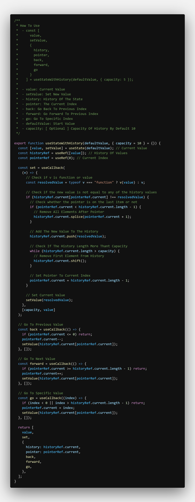
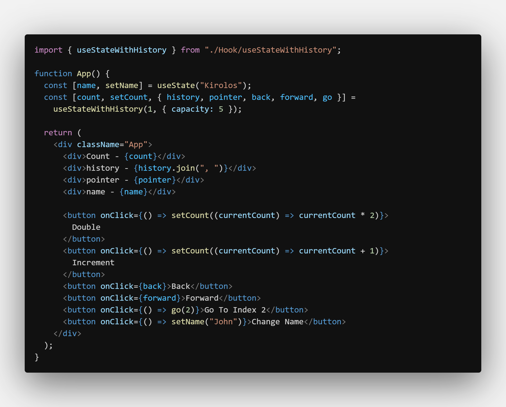

# useStateWithHistory

- Help You Create History For State Values

---

### How To Use

    - const [count, setCount, { history, pointer, back, forward, go }] = useStateWithHistory(1, { capacity: 5 });

    - value: Current Value
    - setValue: Set New Value
    - history: History Of The State
    - pointer: The Current Index
    - back: Go Back To Previous Index
    - forward: Go Forward To Previous Index
    - go: Go To Specific Index
    - defaultValue: Start Value
    - capacity: [ Optional ] Capacity Of History By Default 10

---

## Screenshots

#### useStateWithHistory Hook

#### Example

