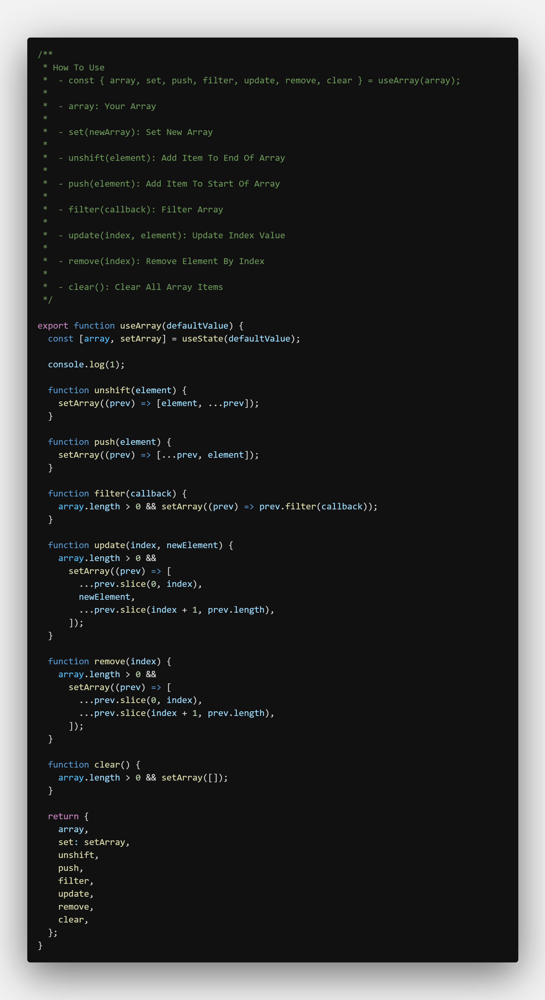
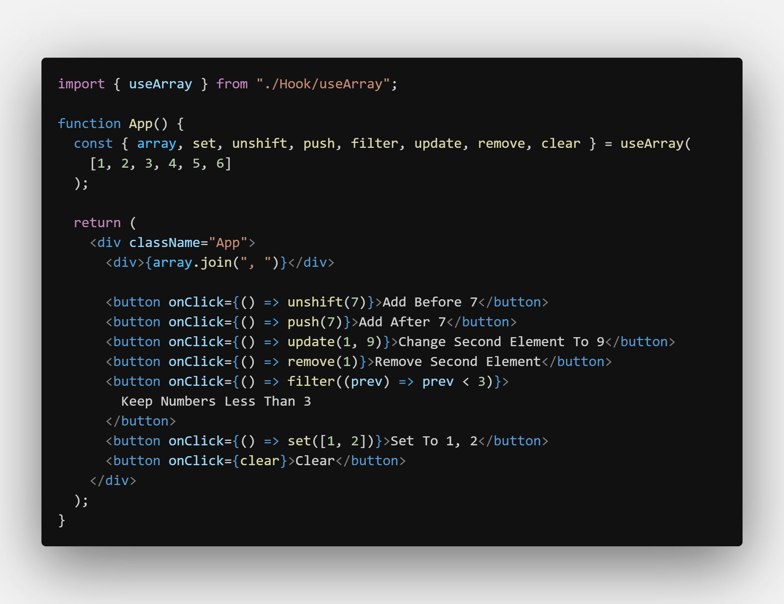

# useArray

- Help You Handle Arrays In State Easy

---

### How To Use

    		- const { array, set, push, filter, update, remove, clear } = useArray(array);

    		- array: Your Array

    		- set(newArray): Set New Array

    		- unshift(element): Add Item To End Of Array

    		- push(element): Add Item To Start Of Array

    		- filter(callback): Filter Array

    		- update(index, element): Update Index Value

    		- remove(index): Remove Element By Index

    		- clear(): Clear All Array Items

---

## Screenshots

#### useArray Hook

#### Example

