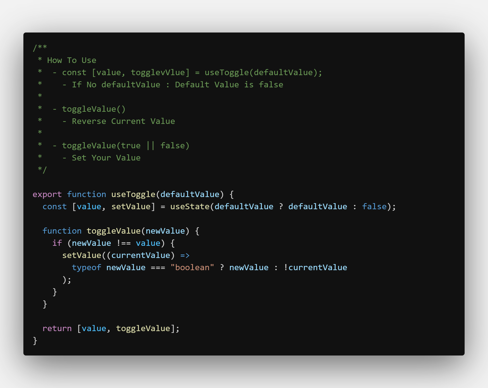
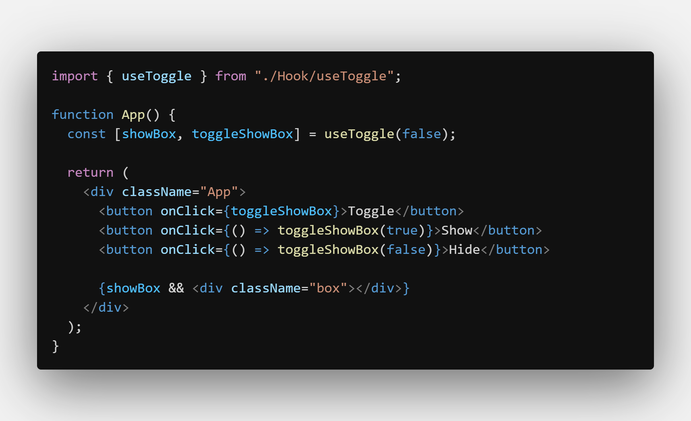

# useToggle

- toggle between true & false

---

### How To Use

    - const [value, togglevValue] = useToggle(defaultValue);
    	- If No defaultValue : Default Value is false

    - toggleValue()
    	- Reverse Current Value

    - toggleValue(true || false)
    	- Set Your Value

---

## Screenshots

#### Hook

#### Example

