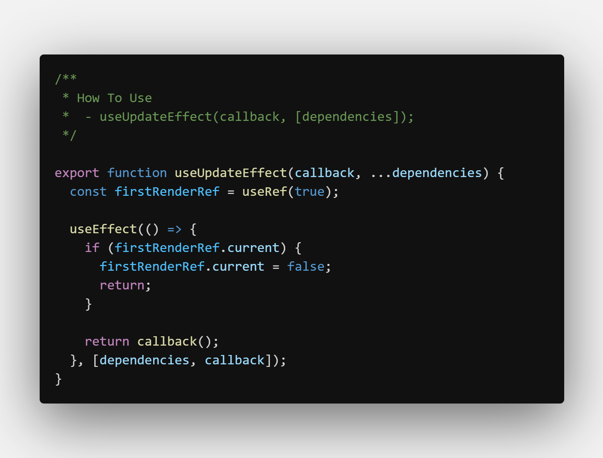

# useUpdateEffect

- Help You Avoid useEffect Side Effect [ Work Only When Update Happen ]

---

### How To Use

    - How To Use
    	- useUpdateEffect(callback, [dependencies]);

---

## Screenshots

#### useUpdateEffect Hook

#### Example

