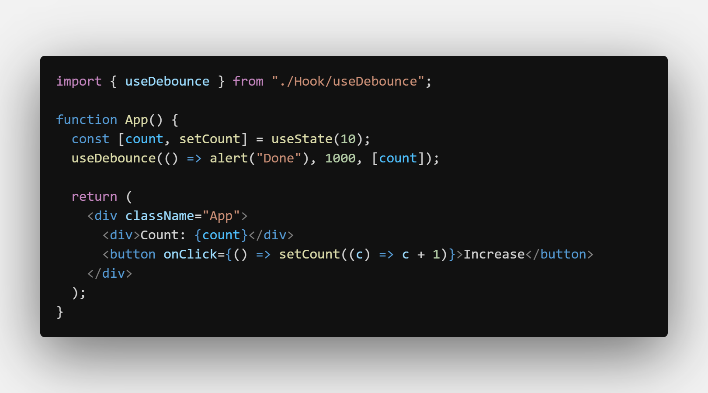

# useDebounce

- Add Debounce Function Easy

---

### How To Use

    - How To Use
    	- You Need useTimeout Hook To Work With useDebounce
    	- useDebounce(callback, delay, [dependencies]);

---

## Screenshots

#### useDebounce Hook

#### Example useDebounce

