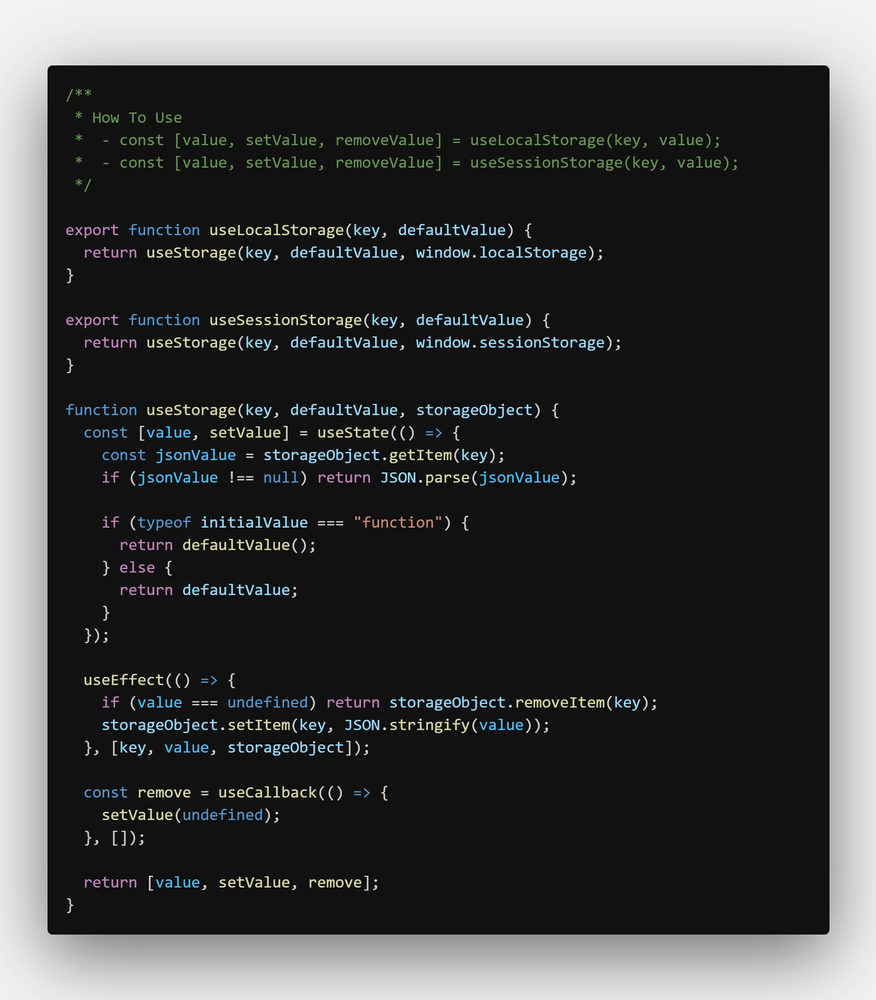
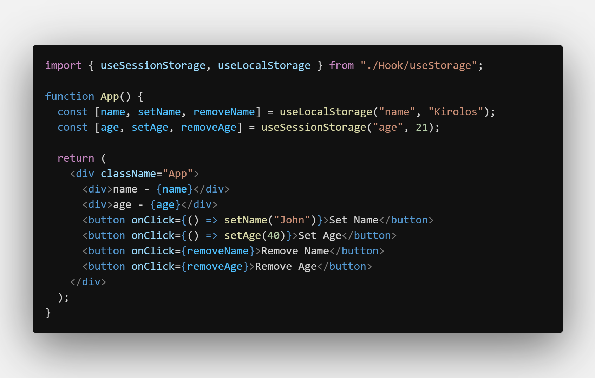

# useStorage

- Help You Use Local & Session Storage Easy

---

### How To Use

    - const [value, setValue, removeValue] = useLocalStorage(key, value);
    - const [value, setValue, removeValue] = useSessionStorage(key, value);

---

## Screenshots

#### useStorage Hook

#### Example

