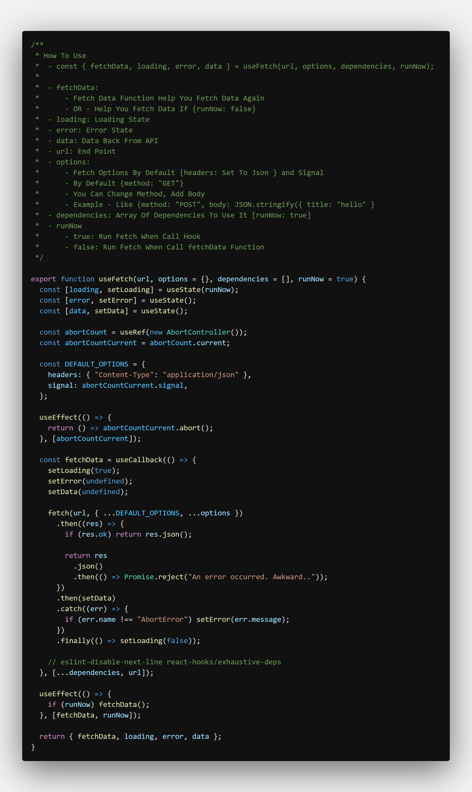
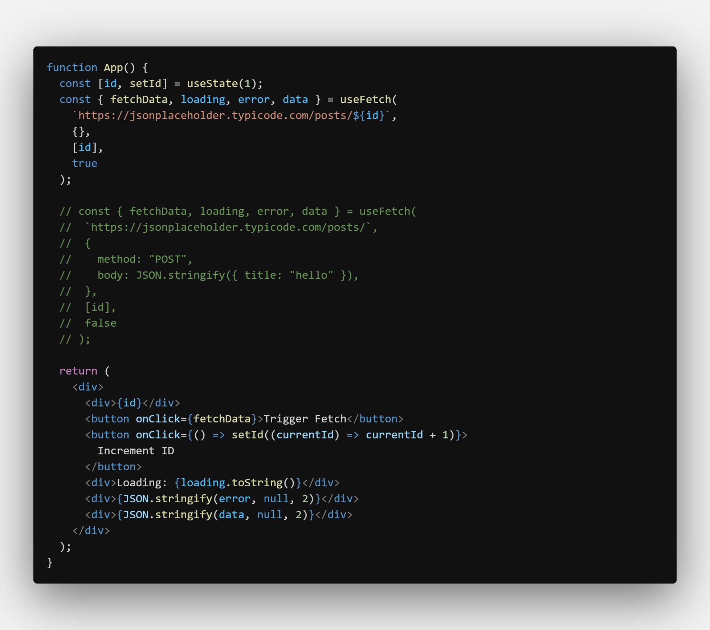

# useFetch

- Help You Handle API Request Easy [ GET, POST, DELETE, PUT, PATCH ]

---

### How To Use

    - const { fetchData, loading, error, data } = useFetch(url, options, dependencies, runNow);

    - fetchData:
    		- Fetch Data Function Help You Fetch Data Again
    		- OR - Help You Fetch Data If {runNow: false}
    - loading: Loading State
    - error: Error State
    - data: Data Back From API
    - url: End Point
    - options:
    		- Fetch Options By Default {headers: Set To Json } and Signal
    		- By Default {method: "GET"}
    		- You Can Change Method, Add Body
    		- Example - Like {method: "POST", body: JSON.stringify({ title: "hello" }
    - dependencies: Array Of Dependencies To Use It [runNow: true]
    - runNow
    		- true: Run Fetch When Call Hook
    		- false: Run Fetch When Call fetchData Function

---

## Screenshots

#### useFetch Hook

#### Example

