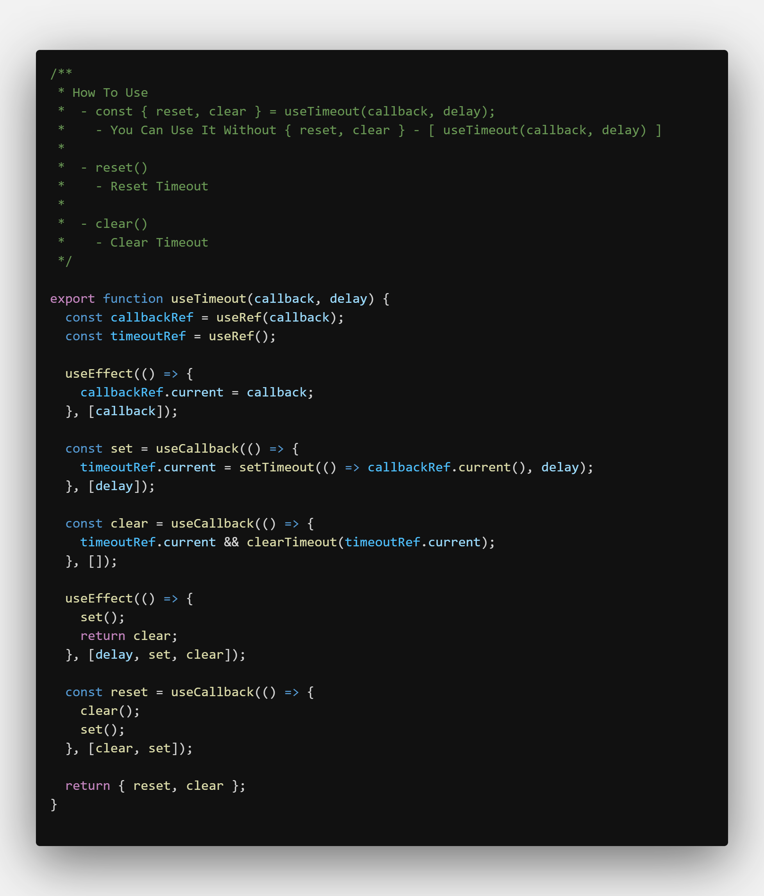
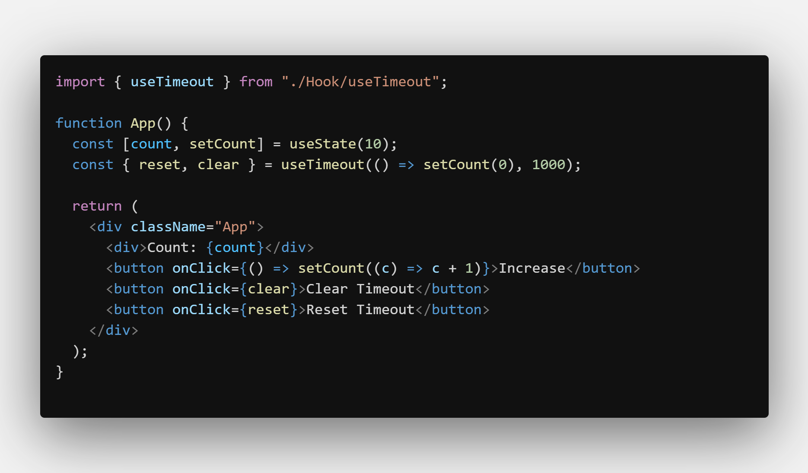

# useTimeout

- Help you create timeout easy

---

### How To Use

    - const { reset, clear } = useTimeout(callback, delay);
    	- You Can Use It Without { reset, clear } - [ useTimeout(callback, delay) ]

    - reset()
    	- Reset Timeout

    - clear()
    	- Clear Timeout

---

## Screenshots

#### Hook

#### Example

